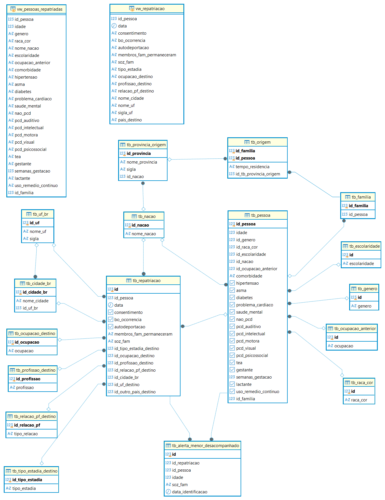

# projetc_db_repatriados
Projeto de modelagem e implementação de bd de repatriados, trabalho final da disciplina de Fundamentos de Bando de Dados do Programa de Pós-Graduação em Computação Aplicada  da UnB.

## 💽​ Modelo lógico do db_repatriados

  

